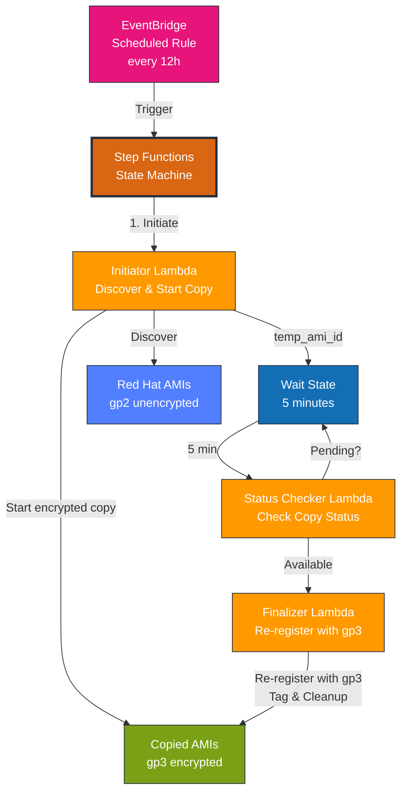
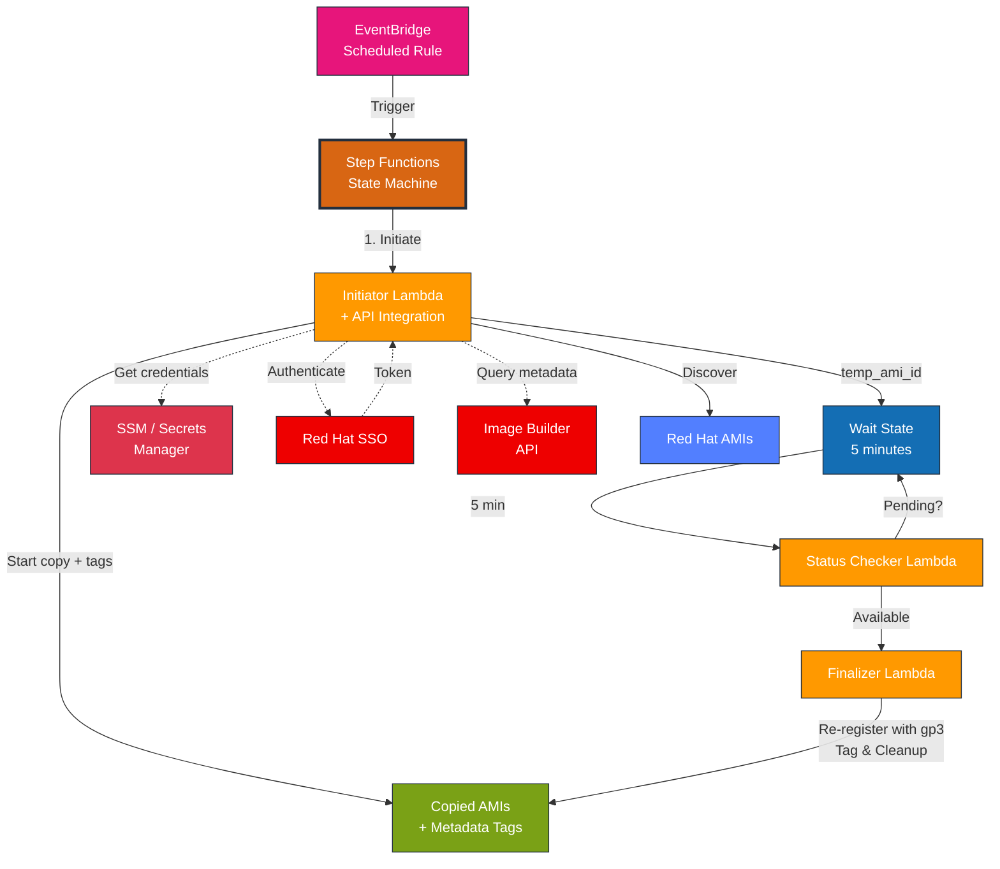

# AMI Auto-Copier for Red Hat Image Builder

Terraform module that automatically copies AMIs shared by Red Hat Image Builder, converting gp2 volumes to gp3 and enabling encryption.

## Overview

Red Hat Image Builder produces AMIs with unencrypted gp2 root volumes. This module solves that by:

1. Polling for AMIs shared by Red Hat Image Builder (scheduled every 12 hours)
2. Automatically copying new AMIs via Lambda function
3. Copying the AMI with:
   - All volumes converted from gp2 to gp3
   - Encryption enabled using AWS managed keys
   - Custom naming and tagging
   - Automatic deduplication to prevent duplicate copies

## Architecture

### Core Flow



### With Optional Red Hat API Integration



**Key Components:**

- **EventBridge Scheduled Rule**: Triggers Step Functions every 12 hours (configurable)
- **Step Functions State Machine**: Orchestrates asynchronous AMI copy workflow, eliminating Lambda timeout issues
- **Initiator Lambda**: Discovers Red Hat AMIs, performs deduplication, enriches metadata (optional), and initiates encrypted copy
- **Status Checker Lambda**: Polls AMI copy status until complete (called repeatedly by Step Functions)
- **Finalizer Lambda**: Re-registers AMI with gp3 volumes, applies tags, and cleans up temporary resources
- **Red Hat AMIs**: Source AMIs shared by Red Hat (Owner: 463606842039) with gp2 unencrypted volumes
- **Copied AMIs**: Target AMIs with gp3 encrypted volumes, custom naming, and automatic tagging
- **SSM/Secrets Manager** _(Optional)_: Stores Red Hat API credentials for metadata enrichment
- **Red Hat SSO** _(Optional)_: OAuth2 authentication for API access
- **Image Builder API** _(Optional)_: Provides compose metadata for enhanced tagging

**Why polling instead of events?**

The initial design attempted to detect AMI sharing via CloudTrail `ModifyImageAttribute` events. However, these events occur in the *creator account* (Red Hat's AWS account), not the consumer account. Polling via scheduled discovery is the correct approach for the consumer account. See [Issue #4](https://github.com/PodioSpaz/ami-copier/issues/4) for details.

**Why Step Functions instead of synchronous Lambda?**

Large AMI copies can take 30+ minutes to complete, but Lambda functions have a maximum timeout of 15 minutes. The Step Functions architecture decouples copy initiation from completion polling, eliminating timeout issues while providing better observability through visual workflow execution history. See [MIGRATION.md](MIGRATION.md) for upgrade instructions from v0.x.

## Requirements

- Terraform >= 1.0
- AWS Provider >= 5.0

## Quick Start

```hcl
module "ami_copier" {
  source = "git::https://github.com/PodioSpaz/ami-copier.git?ref=v1.0.0"

  name_prefix        = "rhel"
  ami_name_template  = "rhel-9-encrypted-{date}"

  tags = {
    Environment = "production"
    ManagedBy   = "terraform"
    OS          = "RHEL"
  }
}
```

**Note:** Pin to a specific version tag (e.g., `v1.0.0`) for production use. For users upgrading from v0.x, see [MIGRATION.md](MIGRATION.md).

## Usage

### Basic Example

```hcl
module "ami_copier" {
  source = "./ami-copier"

  name_prefix = "rhel"

  tags = {
    Project = "my-project"
  }
}
```

### Custom Naming

The `ami_name_template` variable supports placeholders:

- `{source_name}` - Original AMI name (e.g., "composer-api-5bc3b908...")
- `{uuid}` - UUID extracted from Red Hat AMI name (e.g., "5bc3b908-8cdd-489c-ab2f-cfaff7dc972e")
- `{date}` - Current date/time (format: YYYYMMDD-HHMMSS)
- `{timestamp}` - Unix timestamp

**Recommended:** Include `{uuid}` in your template to ensure uniqueness and enable deduplication.

```hcl
module "ami_copier" {
  source = "./ami-copier"

  ami_name_template = "rhel-{uuid}-encrypted-gp3"
  # Result: rhel-5bc3b908-8cdd-489c-ab2f-cfaff7dc972e-encrypted-gp3
}
```

### Custom Name Tag

The `ami_name_tag_template` variable allows you to set a custom **Name tag** on copied AMIs, separate from the AMI's EC2 name. This is useful for creating simpler, more readable display names in the AWS Console.

**Available placeholders:**
- `{distribution}` - RHEL version from Red Hat API (e.g., "rhel-9") - **Requires API integration**
- `{source_name}` - Original AMI name
- `{uuid}` - UUID extracted from Red Hat AMI name
- `{date}` - Current date/time (format: YYYYMMDD-HHMMSS)
- `{timestamp}` - Unix timestamp

**Important:** The Name tag is only applied when the `Distribution` tag is available, which requires Red Hat API integration (`enable_redhat_api = true`). If API integration is disabled or the Distribution tag is unavailable, no Name tag will be set.

```hcl
module "ami_copier" {
  source = "./ami-copier"

  ami_name_template     = "rhel-{uuid}-encrypted-gp3-{date}"  # AMI EC2 name
  ami_name_tag_template = "prod-{distribution}"                # Name tag for display

  # API integration required for Distribution tag
  enable_redhat_api    = true
  redhat_client_id     = var.redhat_client_id
  redhat_client_secret = var.redhat_client_secret

  # Result:
  # - AMI EC2 name: rhel-5bc3b908-...-encrypted-gp3-20251105-142030
  # - Name tag: prod-rhel-9
}
```

### Multiple RHEL Versions

To differentiate between RHEL 9 and RHEL 10:

```hcl
module "rhel9_ami_copier" {
  source = "./ami-copier"

  name_prefix       = "rhel9"
  ami_name_template = "rhel-9-encrypted-{date}"

  tags = {
    OS      = "RHEL"
    Version = "9"
  }
}

module "rhel10_ami_copier" {
  source = "./ami-copier"

  name_prefix       = "rhel10"
  ami_name_template = "rhel-10-encrypted-{date}"

  tags = {
    OS      = "RHEL"
    Version = "10"
  }
}
```

### Red Hat Image Builder API Integration (Enhanced Tagging)

By default, Red Hat Image Builder AMIs have generic names like `composer-api-5bc3b908-8cdd-489c-ab2f-cfaff7dc972e` with no description, making it difficult to identify them. Enable API integration to enrich AMI tags with metadata from Red Hat Image Builder:

**Benefits:**
- **ComposeId** - Links AMI to specific Image Builder compose
- **ImageBuilderName** - Custom name from compose request
- **Distribution** - RHEL version (e.g., "rhel-9", "rhel-10") - Can be used in `ami_name_tag_template` for custom Name tags
- **Architecture** - x86_64 or aarch64
- **ComposeCreatedAt** - When the image was built
- **BlueprintId/BlueprintVersion** - If built from a blueprint
- **PackageCount** - Number of packages in the image

**Setup:**

#### Step 1: Create a Red Hat Service Account

Service accounts are recommended over user tokens as they're not tied to individual users and provide better security for automation:

1. Log in to [Red Hat Hybrid Cloud Console](https://console.redhat.com)
2. Navigate to **Settings → Service Accounts**
3. Click **Create service account**
4. Enter a name (e.g., "ami-copier-automation") and description
5. Save the **Client ID** and **Client secret** (shown only once!)
6. Add the service account to a User Access group with the **RHEL viewer** role:
   - Navigate to **Settings → User Access → Groups**
   - Create a new group or use an existing one
   - Add the **RHEL viewer** role to the group (grants read-only access to RHEL Insights, including Image Builder API)
   - Add your service account to this group

#### Step 2: Enable API Integration (Using SSM Parameter Store - Recommended)

```hcl
module "ami_copier" {
  source = "./ami-copier"

  name_prefix       = "rhel9"
  ami_name_template = "rhel-9-encrypted-{date}"

  # Enable Red Hat API integration with service account
  enable_redhat_api     = true
  redhat_client_id      = var.redhat_client_id      # Store in terraform.tfvars (gitignored)
  redhat_client_secret  = var.redhat_client_secret  # Store in terraform.tfvars (gitignored)

  # Optional: Specify credential store (defaults to "ssm")
  # redhat_credential_store = "ssm"

  tags = {
    Environment = "production"
  }
}
```

**In `terraform.tfvars` (add to .gitignore!):**
```hcl
redhat_client_id     = "your-client-id-here"
redhat_client_secret = "your-client-secret-here"
```

#### Alternative: Using Secrets Manager

If you prefer AWS Secrets Manager over SSM Parameter Store:

```hcl
module "ami_copier" {
  source = "./ami-copier"

  name_prefix       = "rhel9"
  ami_name_template = "rhel-9-encrypted-{date}"

  enable_redhat_api        = true
  redhat_credential_store  = "secretsmanager"
  redhat_client_id         = var.redhat_client_id
  redhat_client_secret     = var.redhat_client_secret

  tags = {
    Environment = "production"
  }
}
```

#### Using Existing Secrets/Parameters

For organizations with security policies that restrict storing sensitive credentials in Terraform state, you can reference existing AWS Secrets Manager secrets or SSM parameters instead of having the module create them.

**Benefits:**
- Keeps credentials completely out of Terraform state
- Allows credential rotation without Terraform changes
- Supports centralized secret management
- Maintains backward compatibility

**Using Existing SSM Parameters:**

```hcl
# First, create the SSM parameters outside of this module
# (e.g., via AWS Console, AWS CLI, or separate Terraform state)
#
# aws ssm put-parameter \
#   --name /my-org/redhat/client-id \
#   --type SecureString \
#   --value "your-client-id"
#
# aws ssm put-parameter \
#   --name /my-org/redhat/client-secret \
#   --type SecureString \
#   --value "your-client-secret"

module "ami_copier" {
  source = "./ami-copier"

  name_prefix       = "rhel9"
  ami_name_template = "rhel-9-encrypted-{date}"

  enable_redhat_api        = true
  redhat_credential_store  = "ssm"

  # Reference existing SSM parameters (provide either name or ARN)
  existing_redhat_client_id_param_name     = "/my-org/redhat/client-id"
  existing_redhat_client_secret_param_name = "/my-org/redhat/client-secret"

  tags = {
    Environment = "production"
  }
}
```

**Using Existing Secrets Manager Secret:**

```hcl
# First, create the secret outside of this module
# The secret must contain JSON with service account credentials:
# {
#   "client_id": "your-client-id",
#   "client_secret": "your-client-secret"
# }
#
# Or for legacy offline token:
# {
#   "offline_token": "your-token"
# }

module "ami_copier" {
  source = "./ami-copier"

  name_prefix       = "rhel9"
  ami_name_template = "rhel-9-encrypted-{date}"

  enable_redhat_api        = true
  redhat_credential_store  = "secretsmanager"

  # Reference existing secret (provide either name or ARN)
  existing_redhat_secret_name = "my-org/redhat-api-credentials"
  # OR
  # existing_redhat_secret_arn = "arn:aws:secretsmanager:us-east-1:123456789:secret:my-secret"

  tags = {
    Environment = "production"
  }
}
```

**Important Notes:**
- When using existing resources, DO NOT provide `redhat_client_id`, `redhat_client_secret`, or `redhat_offline_token` variables
- The module will grant Lambda IAM permissions to access the existing secret/parameters
- For SSM, you can provide either parameter name or ARN (or both)
- For Secrets Manager, you can provide either secret name or ARN (or both)

#### Legacy: Offline Token Authentication (Deprecated)

For backward compatibility, offline token authentication is still supported:

```hcl
module "ami_copier" {
  source = "./ami-copier"

  name_prefix       = "rhel9"
  ami_name_template = "rhel-9-encrypted-{date}"

  enable_redhat_api        = true
  redhat_credential_store  = "secretsmanager"
  redhat_offline_token     = var.redhat_offline_token

  tags = {
    Environment = "production"
  }
}
```

**Note:** Offline tokens are tied to user accounts and expire after 30 days of inactivity. Service accounts are recommended for production use.

**How it works:**
- Initiator Lambda queries the Image Builder API to find the compose that produced the AMI
- Enriches tags with metadata like distribution, architecture, package count
- Falls back to basic tagging if API is unavailable
- Credentials stored securely in SSM Parameter Store (default) or Secrets Manager

## How It Works

### Scheduled Discovery

The module creates an EventBridge scheduled rule that runs every 12 hours (configurable via `schedule_expression` variable). When triggered, the Step Functions state machine:

1. Invokes the Initiator Lambda which queries `DescribeImages` with owner filter: `463606842039` (Red Hat's AWS account ID)
2. Filters for AMIs in `available` state
3. Processes each discovered AMI through the asynchronous workflow (Wait → Status Check → Finalize)

### Deduplication

To prevent copying the same AMI multiple times:

1. **Extract UUID** - Parses Red Hat AMI name pattern: `composer-api-{uuid}`
2. **Generate Target Name** - Uses `ami_name_template` with placeholders replaced (including `{uuid}`)
3. **Check Existence** - Queries `DescribeImages` (owner: self) for AMIs with that exact name
4. **Skip if Found** - Logs skip message and moves to next AMI

This ensures each Red Hat AMI is copied only once, even if the scheduled job runs multiple times.

### Step Functions Workflow

The Step Functions state machine orchestrates an asynchronous AMI copy workflow using three Lambda functions. It supports two invocation modes:

**Scheduled Mode** (triggered by EventBridge):
```bash
# Automatically runs every 12 hours (configurable)
# Discovers all shared Red Hat AMIs and processes each one
```

**Manual Mode** (direct invocation with specific AMI ID):
```bash
# Start a state machine execution for a specific AMI
aws stepfunctions start-execution \
  --state-machine-arn <state-machine-arn> \
  --input '{"source_ami_id":"ami-xxxxx"}' \
  --name "manual-$(date +%s)"

# Check execution status
aws stepfunctions describe-execution \
  --execution-arn <execution-arn>

# View execution history
aws stepfunctions get-execution-history \
  --execution-arn <execution-arn>
```

**Workflow Steps:**

**1. Initiator Lambda** (`lambda/initiator.py`):
   - Discovers shared Red Hat AMIs (or processes single AMI from input)
   - Extracts UUID from source AMI name (if pattern matches)
   - Checks if target AMI already exists (deduplication)
   - Enriches tags with Red Hat Image Builder API metadata (if enabled)
   - Initiates encrypted AMI copy (`ec2:CopyImage` with `Encrypted=True`)
   - Returns array of AMIs to process with temp_ami_id for each

**2. Wait State** (configurable, default 5 minutes):
   - Pauses between status checks to avoid excessive API calls

**3. Status Checker Lambda** (`lambda/status_checker.py`):
   - Checks AMI copy status via `ec2:DescribeImages`
   - Returns `continue_waiting=true` if still pending
   - Returns `ami_available=true` when copy completes
   - Step Functions loops back to Wait State until available

**4. Finalizer Lambda** (`lambda/finalizer.py`):
   - Retrieves temporary AMI's block device mappings and snapshots
   - Deregisters temporary AMI (snapshots retained)
   - Re-registers AMI with gp3 volumes using `ec2:RegisterImage`
   - Applies tags:
     - User-provided tags
     - `SourceAMI` - ID of the original AMI
     - `SourceAMIUUID` - UUID from source AMI name
     - `CopiedBy` - Set to "ami-copier-lambda"
     - `CopyDate` - ISO timestamp
     - Red Hat API metadata (if enabled)
   - Cleans up temporary resources

**Why two-step copy process?**

The AWS `copy_image()` API doesn't accept `BlockDeviceMappings` parameter. To convert gp2→gp3, we must:
1. First copy with encryption enabled (creates encrypted gp2 snapshots)
2. Then re-register using those snapshots with gp3 volume type in mappings

This ensures all volumes are encrypted gp3 in the final AMI.

### Permissions

The Lambda functions require these IAM permissions:

- `ec2:DescribeImages` - Read source and target AMI details
- `ec2:CopyImage` - Copy AMIs with encryption
- `ec2:RegisterImage` - Re-register AMI with gp3 volumes
- `ec2:DeregisterImage` - Clean up temporary AMIs
- `ec2:CreateTags` - Tag copied AMIs
- `ec2:DescribeSnapshots` - Read snapshot details for re-registration
- `logs:CreateLogGroup`, `logs:CreateLogStream`, `logs:PutLogEvents` - CloudWatch Logs

The Step Functions state machine requires:

- `lambda:InvokeFunction` - Invoke the three Lambda functions
- `states:*` - Manage execution state and logging

## Versioning

This module follows [Semantic Versioning](https://semver.org/). Releases are automated using [Release Please](https://github.com/googleapis/release-please).

### Referencing Specific Versions

Always pin to a specific version in production:

```hcl
# Pin to a specific version (recommended)
module "ami_copier" {
  source = "git::https://github.com/PodioSpaz/ami-copier.git?ref=v0.1.0"
  # ...
}

# Pin to a minor version (automatically get patch updates)
module "ami_copier" {
  source = "git::https://github.com/PodioSpaz/ami-copier.git?ref=v0.1"
  # ...
}

# Use latest (not recommended for production)
module "ami_copier" {
  source = "git::https://github.com/PodioSpaz/ami-copier.git"
  # ...
}
```

### Version History

See [CHANGELOG.md](CHANGELOG.md) for a detailed history of changes.

### Release Process

Releases are fully automated:
1. Commits following [Conventional Commits](https://www.conventionalcommits.org/) are pushed to `main`
2. Release Please automatically creates/updates a release PR
3. Merging the release PR creates a new GitHub release with a version tag
4. The CHANGELOG is automatically updated

**Commit message → Version bump:**
- `feat:` → Minor version (0.1.0 → 0.2.0)
- `fix:` → Patch version (0.1.0 → 0.1.1)
- `feat!:` or `BREAKING CHANGE:` → Major version (0.1.0 → 1.0.0)
- `docs:`, `chore:`, `ci:` → No release

## Inputs

| Name | Description | Type | Default | Required |
|------|-------------|------|---------|----------|
| name_prefix | Prefix for naming resources | string | "rhel" | no |
| ami_name_template | Template for AMI names (supports {source_name}, {uuid}, {date}, {timestamp}) | string | "rhel-{uuid}-encrypted-gp3-{date}" | no |
| ami_name_tag_template | Template for Name tag on copied AMIs (supports {distribution}, {source_name}, {uuid}, {date}, {timestamp}). Only applied when Distribution tag is available from API integration. | string | "" | no |
| tags | Tags to apply to copied AMIs and resources | map(string) | {} | no |
| status_check_wait_time | Time in seconds to wait between AMI copy status checks in Step Functions (60-3600) | number | 300 | no |
| lambda_memory_size | Lambda memory in MB (128-10240) | number | 256 | no |
| log_retention_days | CloudWatch Logs retention period | number | 7 | no |
| schedule_expression | EventBridge schedule expression (e.g., 'rate(12 hours)', 'cron(0 */12 * * ? *)') | string | "rate(12 hours)" | no |
| enable_redhat_api | Enable Red Hat Image Builder API integration for enhanced tagging | bool | false | no |
| redhat_credential_store | Credential storage: 'ssm' (Parameter Store) or 'secretsmanager' (Secrets Manager) | string | "ssm" | no |
| redhat_client_id | Red Hat Service Account Client ID (required if enable_redhat_api=true and not using existing secrets) | string (sensitive) | "" | no |
| redhat_client_secret | Red Hat Service Account Client Secret (required if enable_redhat_api=true and not using existing secrets) | string (sensitive) | "" | no |
| redhat_offline_token | [DEPRECATED] Red Hat offline token for legacy authentication | string (sensitive) | "" | no |
| existing_redhat_secret_arn | ARN of existing Secrets Manager secret containing Red Hat credentials (optional, keeps credentials out of Terraform state) | string | "" | no |
| existing_redhat_secret_name | Name of existing Secrets Manager secret containing Red Hat credentials (optional, keeps credentials out of Terraform state) | string | "" | no |
| existing_redhat_client_id_param_arn | ARN of existing SSM parameter containing Red Hat client ID (optional, keeps credentials out of Terraform state) | string | "" | no |
| existing_redhat_client_id_param_name | Name of existing SSM parameter containing Red Hat client ID (optional, keeps credentials out of Terraform state) | string | "" | no |
| existing_redhat_client_secret_param_arn | ARN of existing SSM parameter containing Red Hat client secret (optional, keeps credentials out of Terraform state) | string | "" | no |
| existing_redhat_client_secret_param_name | Name of existing SSM parameter containing Red Hat client secret (optional, keeps credentials out of Terraform state) | string | "" | no |

## Outputs

| Name | Description |
|------|-------------|
| state_machine_arn | ARN of the Step Functions state machine |
| state_machine_name | Name of the Step Functions state machine |
| initiator_lambda_arn | ARN of the initiator Lambda function |
| initiator_lambda_name | Name of the initiator Lambda function |
| status_checker_lambda_arn | ARN of the status checker Lambda function |
| status_checker_lambda_name | Name of the status checker Lambda function |
| finalizer_lambda_arn | ARN of the finalizer Lambda function |
| finalizer_lambda_name | Name of the finalizer Lambda function |
| lambda_role_arn | ARN of the Lambda IAM role |
| step_functions_role_arn | ARN of the Step Functions IAM role |
| eventbridge_rule_arn | ARN of the EventBridge scheduled rule |
| eventbridge_rule_name | Name of the EventBridge scheduled rule |
| schedule_expression | Schedule expression for automated discovery |
| cloudwatch_log_group_names | Map of CloudWatch Log Group names (initiator, status_checker, finalizer, step_functions) |
| redhat_api_secret_arn | ARN of the Secrets Manager secret (if using secretsmanager credential store) |
| redhat_ssm_parameter_arns | ARNs of SSM parameters for client_id and client_secret (if using ssm credential store) |

## Troubleshooting

### AMIs Not Being Copied

1. **Verify Red Hat has shared AMIs with your account:**
   ```bash
   aws ec2 describe-images --owners 463606842039 --filters "Name=state,Values=available"
   ```

2. **Check EventBridge scheduled rule:**
   ```bash
   aws events describe-rule --name <name-prefix>-ami-discovery

   # Verify the target is the Step Functions state machine
   aws events list-targets-by-rule --rule <name-prefix>-ami-discovery
   ```

3. **Check recent Step Functions executions:**
   ```bash
   # Get state machine ARN from Terraform outputs
   STATE_MACHINE_ARN=$(terraform output -raw state_machine_arn)

   # List recent executions
   aws stepfunctions list-executions \
     --state-machine-arn $STATE_MACHINE_ARN \
     --max-results 10

   # Check specific execution status
   aws stepfunctions describe-execution \
     --execution-arn <execution-arn>
   ```

4. **Check logs for recent runs:**
   ```bash
   # Step Functions logs
   aws logs tail /aws/vendedlogs/states/<name-prefix>-ami-copier --follow

   # Initiator Lambda logs
   aws logs tail /aws/lambda/<name-prefix>-ami-copier-initiator --since 24h
   ```
   Look for: "Scheduled polling mode: Discovering shared Red Hat AMIs"

5. **Manually trigger the Step Functions state machine to test:**
   ```bash
   # Trigger discovery mode (scans all Red Hat AMIs)
   aws stepfunctions start-execution \
     --state-machine-arn $STATE_MACHINE_ARN \
     --input '{}' \
     --name "manual-test-$(date +%s)"

   # Or test with a specific AMI
   aws stepfunctions start-execution \
     --state-machine-arn $STATE_MACHINE_ARN \
     --input '{"source_ami_id":"ami-xxxxx"}' \
     --name "manual-ami-$(date +%s)"
   ```

### Duplicate Copies

The module includes automatic deduplication. If an AMI with the same name already exists, it will be skipped. Check Initiator Lambda logs for: "AMI with name 'X' already exists, skipping copy"

To force re-copy, either:
- Change the `ami_name_template` variable
- Deregister the existing copied AMI

### Step Functions Execution Failures

If executions fail or get stuck:

1. **Check execution history:**
   ```bash
   aws stepfunctions get-execution-history \
     --execution-arn <execution-arn> \
     --max-results 100
   ```

2. **Common issues:**
   - **AMI copy taking too long**: Adjust `status_check_wait_time` (default: 5 minutes) - Step Functions can wait indefinitely
   - **Lambda errors**: Check individual Lambda logs (initiator, status_checker, finalizer)
   - **IAM permissions**: Verify Lambda role has required EC2 permissions
   - **Temporary AMI cleanup failed**: Check Finalizer Lambda logs, may need manual cleanup

3. **View visual workflow in AWS Console:**
   - Navigate to Step Functions → State machines → `<name-prefix>-ami-copier`
   - Click on failed execution to see which step failed

### Finding Copied AMIs

```bash
aws ec2 describe-images \
  --owners self \
  --filters "Name=tag:CopiedBy,Values=ami-copier-lambda"
```

## Monitoring

### CloudWatch Logs

The module creates separate CloudWatch Log Groups for each component:

```bash
# Step Functions execution logs
aws logs tail /aws/vendedlogs/states/<name-prefix>-ami-copier --follow

# Lambda function logs
aws logs tail /aws/lambda/<name-prefix>-ami-copier-initiator --follow
aws logs tail /aws/lambda/<name-prefix>-ami-copier-status-checker --follow
aws logs tail /aws/lambda/<name-prefix>-ami-copier-finalizer --follow
```

### Step Functions Console

The AWS Console provides a visual interface for monitoring executions:

1. Navigate to **Step Functions → State machines**
2. Select `<name-prefix>-ami-copier`
3. View execution history with visual workflow representation
4. Click on any execution to see:
   - Input/output for each step
   - Execution timeline
   - Error details (if any)

### Metrics and Alarms

You can create CloudWatch alarms for:

- **Failed executions**: Monitor `ExecutionsFailed` metric
- **Execution duration**: Monitor `ExecutionTime` metric
- **Lambda errors**: Monitor individual Lambda function error rates

Example alarm for failed executions:

```bash
aws cloudwatch put-metric-alarm \
  --alarm-name ami-copier-execution-failures \
  --alarm-description "Alert on Step Functions execution failures" \
  --metric-name ExecutionsFailed \
  --namespace AWS/States \
  --statistic Sum \
  --period 3600 \
  --evaluation-periods 1 \
  --threshold 1 \
  --comparison-operator GreaterThanThreshold \
  --dimensions Name=StateMachineArn,Value=<state-machine-arn>
```

## Cost Considerations

- **Step Functions**: $0.025 per 1,000 state transitions (free tier: 4,000 per month)
- **Lambda**: Free tier covers most usage (1M requests/month, 400,000 GB-seconds)
  - Three Lambda functions per AMI copy (Initiator, Status Checker, Finalizer)
  - Status Checker invoked multiple times until AMI copy completes
- **CloudWatch Logs**: Minimal (~$0.50/GB ingested)
- **EBS Snapshots**: You pay for snapshot storage of copied AMIs
- **EventBridge**: Free for scheduled rules

The original AMI shared by Red Hat is:
- Owned by Red Hat (not your account)
- Available for 14 days
- Does not incur storage costs to you
- Cannot be deregistered by you

## License

This project is licensed under the MIT License.

## Contributing

Contributions welcome! Please open an issue or PR.
