# AMI Auto-Copier for Red Hat Image Builder

Terraform module that automatically copies AMIs shared by Red Hat Image Builder, converting gp2 volumes to gp3 and enabling encryption.

## Overview

Red Hat Image Builder produces AMIs with unencrypted gp2 root volumes. This module solves that by:

1. Polling for AMIs shared by Red Hat Image Builder (scheduled every 12 hours)
2. Automatically copying new AMIs via Lambda function
3. Copying the AMI with:
   - All volumes converted from gp2 to gp3
   - Encryption enabled using AWS managed keys
   - Custom naming and tagging
   - Automatic deduplication to prevent duplicate copies

## Architecture

```mermaid
graph TB
    subgraph "AWS Account"
        EB[EventBridge Scheduled Rule<br/>rate: 12 hours]

        subgraph "Lambda Execution"
            Lambda[Lambda Function<br/>ami_copier.py]
            IAM[IAM Role & Policies<br/>EC2, CloudWatch Logs]
        end

        subgraph "Credential Storage<br/><i>Optional: API Integration</i>"
            SSM[SSM Parameter Store<br/>client_id + client_secret]
            SM[Secrets Manager<br/>client_id + client_secret]
        end

        subgraph "EC2 Service"
            Source[Red Hat Shared AMIs<br/>Owner: 463606842039<br/>gp2 unencrypted]
            Target[Copied AMIs<br/>gp3 encrypted<br/>Tagged & Named]
        end

        CW[CloudWatch Logs<br/>/aws/lambda/ami-copier]
    end

    subgraph "Red Hat Services<br/><i>Optional Integration</i>"
        SSO[Red Hat SSO<br/>OAuth2 Token Exchange]
        API[Image Builder API<br/>Compose Metadata]
    end

    %% Main Flow
    EB -->|Triggers every 12h| Lambda
    Lambda -->|DescribeImages<br/>Filter: Owner=463606842039| Source
    Lambda -->|Check Deduplication<br/>DescribeImages: Owner=self| Target
    Lambda -->|CopyImage<br/>Encrypted=true<br/>gp2→gp3| Target
    Lambda -->|Uses| IAM
    Lambda -->|Writes logs| CW

    %% Optional API Integration
    Lambda -.->|Retrieve credentials<br/>if enabled| SSM
    Lambda -.->|Retrieve credentials<br/>if enabled| SM
    Lambda -.->|Authenticate<br/>client_credentials grant| SSO
    SSO -.->|Access Token<br/>15min lifetime| Lambda
    Lambda -.->|Query compose metadata<br/>GET /composes?limit=100| API
    API -.->|Enriched tags<br/>Distribution, Architecture, etc.| Lambda

    %% Styling
    classDef optional stroke-dasharray: 5 5
    class SSM,SM,SSO,API optional

    style Lambda fill:#FF9900,stroke:#232F3E,color:#fff
    style EB fill:#E7157B,stroke:#232F3E,color:#fff
    style Source fill:#527FFF,stroke:#232F3E,color:#fff
    style Target fill:#7AA116,stroke:#232F3E,color:#fff
    style CW fill:#FF4F8B,stroke:#232F3E,color:#fff
    style SSO fill:#EE0000,stroke:#232F3E,color:#fff
    style API fill:#EE0000,stroke:#232F3E,color:#fff
```



**Key Components:**

- **EventBridge Scheduled Rule**: Triggers Lambda every 12 hours (configurable)
- **Lambda Function**: Polls for Red Hat AMIs, performs deduplication, and copies with encryption
- **IAM Role**: Grants permissions for EC2 operations and CloudWatch logging
- **CloudWatch Logs**: Captures Lambda execution logs and errors
- **Credential Storage** _(Optional)_: SSM Parameter Store (default) or Secrets Manager for Red Hat API credentials
- **Red Hat Services** _(Optional)_: OAuth2 authentication and Image Builder API for metadata enrichment

**Why polling instead of events?**

The initial design attempted to detect AMI sharing via CloudTrail `ModifyImageAttribute` events. However, these events occur in the *creator account* (Red Hat's AWS account), not the consumer account. Polling via scheduled discovery is the correct approach for the consumer account. See [Issue #4](https://github.com/PodioSpaz/ami-copier/issues/4) for details.

## Requirements

- Terraform >= 1.0
- AWS Provider >= 5.0

## Quick Start

```hcl
module "ami_copier" {
  source = "git::https://github.com/PodioSpaz/ami-copier.git?ref=v0.1.0"

  name_prefix        = "rhel"
  ami_name_template  = "rhel-9-encrypted-{date}"

  tags = {
    Environment = "production"
    ManagedBy   = "terraform"
    OS          = "RHEL"
  }
}
```

**Note:** Pin to a specific version tag (e.g., `v0.1.0`) for production use.

## Usage

### Basic Example

```hcl
module "ami_copier" {
  source = "./ami-copier"

  name_prefix = "rhel"

  tags = {
    Project = "my-project"
  }
}
```

### Custom Naming

The `ami_name_template` variable supports placeholders:

- `{source_name}` - Original AMI name (e.g., "composer-api-5bc3b908...")
- `{uuid}` - UUID extracted from Red Hat AMI name (e.g., "5bc3b908-8cdd-489c-ab2f-cfaff7dc972e")
- `{date}` - Current date/time (format: YYYYMMDD-HHMMSS)
- `{timestamp}` - Unix timestamp

**Recommended:** Include `{uuid}` in your template to ensure uniqueness and enable deduplication.

```hcl
module "ami_copier" {
  source = "./ami-copier"

  ami_name_template = "rhel-{uuid}-encrypted-gp3"
  # Result: rhel-5bc3b908-8cdd-489c-ab2f-cfaff7dc972e-encrypted-gp3
}
```

### Multiple RHEL Versions

To differentiate between RHEL 9 and RHEL 10:

```hcl
module "rhel9_ami_copier" {
  source = "./ami-copier"

  name_prefix       = "rhel9"
  ami_name_template = "rhel-9-encrypted-{date}"

  tags = {
    OS      = "RHEL"
    Version = "9"
  }
}

module "rhel10_ami_copier" {
  source = "./ami-copier"

  name_prefix       = "rhel10"
  ami_name_template = "rhel-10-encrypted-{date}"

  tags = {
    OS      = "RHEL"
    Version = "10"
  }
}
```

### Longer Lambda Timeout

For large AMIs that take longer to copy:

```hcl
module "ami_copier" {
  source = "./ami-copier"

  lambda_timeout = 600  # 10 minutes
}
```

### Red Hat Image Builder API Integration (Enhanced Tagging)

By default, Red Hat Image Builder AMIs have generic names like `composer-api-5bc3b908-8cdd-489c-ab2f-cfaff7dc972e` with no description, making it difficult to identify them. Enable API integration to enrich AMI tags with metadata from Red Hat Image Builder:

**Benefits:**
- **ComposeId** - Links AMI to specific Image Builder compose
- **ImageBuilderName** - Custom name from compose request
- **Distribution** - RHEL version (e.g., "rhel-9", "rhel-10")
- **Architecture** - x86_64 or aarch64
- **ComposeCreatedAt** - When the image was built
- **BlueprintId/BlueprintVersion** - If built from a blueprint
- **PackageCount** - Number of packages in the image

**Setup:**

#### Step 1: Create a Red Hat Service Account

Service accounts are recommended over user tokens as they're not tied to individual users and provide better security for automation:

1. Log in to [Red Hat Hybrid Cloud Console](https://console.redhat.com)
2. Navigate to **Settings → Service Accounts**
3. Click **Create service account**
4. Enter a name (e.g., "ami-copier-automation") and description
5. Save the **Client ID** and **Client secret** (shown only once!)
6. Add the service account to a User Access group with the **RHEL viewer** role:
   - Navigate to **Settings → User Access → Groups**
   - Create a new group or use an existing one
   - Add the **RHEL viewer** role to the group (grants read-only access to RHEL Insights, including Image Builder API)
   - Add your service account to this group

#### Step 2: Enable API Integration (Using SSM Parameter Store - Recommended)

```hcl
module "ami_copier" {
  source = "./ami-copier"

  name_prefix       = "rhel9"
  ami_name_template = "rhel-9-encrypted-{date}"

  # Enable Red Hat API integration with service account
  enable_redhat_api     = true
  redhat_client_id      = var.redhat_client_id      # Store in terraform.tfvars (gitignored)
  redhat_client_secret  = var.redhat_client_secret  # Store in terraform.tfvars (gitignored)

  # Optional: Specify credential store (defaults to "ssm")
  # redhat_credential_store = "ssm"

  tags = {
    Environment = "production"
  }
}
```

**In `terraform.tfvars` (add to .gitignore!):**
```hcl
redhat_client_id     = "your-client-id-here"
redhat_client_secret = "your-client-secret-here"
```

#### Alternative: Using Secrets Manager

If you prefer AWS Secrets Manager over SSM Parameter Store:

```hcl
module "ami_copier" {
  source = "./ami-copier"

  name_prefix       = "rhel9"
  ami_name_template = "rhel-9-encrypted-{date}"

  enable_redhat_api        = true
  redhat_credential_store  = "secretsmanager"
  redhat_client_id         = var.redhat_client_id
  redhat_client_secret     = var.redhat_client_secret

  tags = {
    Environment = "production"
  }
}
```

#### Legacy: Offline Token Authentication (Deprecated)

For backward compatibility, offline token authentication is still supported:

```hcl
module "ami_copier" {
  source = "./ami-copier"

  name_prefix       = "rhel9"
  ami_name_template = "rhel-9-encrypted-{date}"

  enable_redhat_api        = true
  redhat_credential_store  = "secretsmanager"
  redhat_offline_token     = var.redhat_offline_token

  tags = {
    Environment = "production"
  }
}
```

**Note:** Offline tokens are tied to user accounts and expire after 30 days of inactivity. Service accounts are recommended for production use.

**How it works:**
- Lambda queries the Image Builder API to find the compose that produced the AMI
- Enriches tags with metadata like distribution, architecture, package count
- Falls back to basic tagging if API is unavailable
- Credentials stored securely in SSM Parameter Store (default) or Secrets Manager

**Performance Note:** The Lambda timeout may need to be increased to 600 seconds when API integration is enabled, as it makes multiple HTTP requests to Red Hat's API.

## How It Works

### Scheduled Discovery

The module creates an EventBridge scheduled rule that runs every 12 hours (configurable via `schedule_expression` variable). When triggered, the Lambda function:

1. Queries `DescribeImages` with owner filter: `463606842039` (Red Hat's AWS account ID)
2. Filters for AMIs in `available` state
3. Processes each discovered AMI

### Deduplication

To prevent copying the same AMI multiple times:

1. **Extract UUID** - Parses Red Hat AMI name pattern: `composer-api-{uuid}`
2. **Generate Target Name** - Uses `ami_name_template` with placeholders replaced (including `{uuid}`)
3. **Check Existence** - Queries `DescribeImages` (owner: self) for AMIs with that exact name
4. **Skip if Found** - Logs skip message and moves to next AMI

This ensures each Red Hat AMI is copied only once, even if the scheduled job runs multiple times.

### Lambda Function

The Lambda function (`lambda/ami_copier.py`) supports two invocation modes:

**Scheduled Mode** (triggered by EventBridge):
1. Discovers all shared Red Hat AMIs
2. Processes each AMI (with deduplication)
3. Returns summary of copied/skipped/errors

**Manual Mode** (direct invocation with specific AMI ID):
```bash
aws lambda invoke \
  --function-name <name>-ami-copier \
  --payload '{"source_ami_id":"ami-xxxxx"}' \
  response.json
```

For each AMI, the Lambda:

1. Extracts UUID from source AMI name (if pattern matches)
2. Describes the source AMI to get block device mappings
3. Checks if target AMI name already exists (deduplication)
4. Converts all gp2 volumes to gp3
5. Copies the AMI with:
   - `Encrypted=True` (using AWS managed key)
   - Modified block device mappings (gp3)
   - Generated name from template
6. Tags the new AMI with:
   - User-provided tags
   - `SourceAMI` - ID of the original AMI
   - `SourceAMIUUID` - UUID from source AMI name
   - `CopiedBy` - Set to "ami-copier-lambda"
   - `CopyDate` - ISO timestamp

### Permissions

The Lambda function requires these IAM permissions:

- `ec2:DescribeImages` - Read source AMI details
- `ec2:CopyImage` - Copy the AMI
- `ec2:CreateTags` - Tag the copied AMI
- `ec2:DescribeSnapshots` - List snapshots
- `logs:*` - CloudWatch Logs

## Versioning

This module follows [Semantic Versioning](https://semver.org/). Releases are automated using [Release Please](https://github.com/googleapis/release-please).

### Referencing Specific Versions

Always pin to a specific version in production:

```hcl
# Pin to a specific version (recommended)
module "ami_copier" {
  source = "git::https://github.com/PodioSpaz/ami-copier.git?ref=v0.1.0"
  # ...
}

# Pin to a minor version (automatically get patch updates)
module "ami_copier" {
  source = "git::https://github.com/PodioSpaz/ami-copier.git?ref=v0.1"
  # ...
}

# Use latest (not recommended for production)
module "ami_copier" {
  source = "git::https://github.com/PodioSpaz/ami-copier.git"
  # ...
}
```

### Version History

See [CHANGELOG.md](CHANGELOG.md) for a detailed history of changes.

### Release Process

Releases are fully automated:
1. Commits following [Conventional Commits](https://www.conventionalcommits.org/) are pushed to `main`
2. Release Please automatically creates/updates a release PR
3. Merging the release PR creates a new GitHub release with a version tag
4. The CHANGELOG is automatically updated

**Commit message → Version bump:**
- `feat:` → Minor version (0.1.0 → 0.2.0)
- `fix:` → Patch version (0.1.0 → 0.1.1)
- `feat!:` or `BREAKING CHANGE:` → Major version (0.1.0 → 1.0.0)
- `docs:`, `chore:`, `ci:` → No release

## Inputs

| Name | Description | Type | Default | Required |
|------|-------------|------|---------|----------|
| name_prefix | Prefix for naming resources | string | "rhel" | no |
| ami_name_template | Template for AMI names (supports {source_name}, {uuid}, {date}, {timestamp}) | string | "rhel-{uuid}-encrypted-gp3-{date}" | no |
| tags | Tags to apply to copied AMIs and resources | map(string) | {} | no |
| lambda_timeout | Lambda timeout in seconds (60-900) | number | 300 | no |
| lambda_memory_size | Lambda memory in MB (128-10240) | number | 256 | no |
| log_retention_days | CloudWatch Logs retention period | number | 7 | no |
| schedule_expression | EventBridge schedule expression (e.g., 'rate(12 hours)', 'cron(0 */12 * * ? *)') | string | "rate(12 hours)" | no |
| enable_redhat_api | Enable Red Hat Image Builder API integration for enhanced tagging | bool | false | no |
| redhat_credential_store | Credential storage: 'ssm' (Parameter Store) or 'secretsmanager' (Secrets Manager) | string | "ssm" | no |
| redhat_client_id | Red Hat Service Account Client ID (required if enable_redhat_api=true) | string (sensitive) | "" | no |
| redhat_client_secret | Red Hat Service Account Client Secret (required if enable_redhat_api=true) | string (sensitive) | "" | no |
| redhat_offline_token | [DEPRECATED] Red Hat offline token for legacy authentication | string (sensitive) | "" | no |

## Outputs

| Name | Description |
|------|-------------|
| lambda_function_arn | ARN of the Lambda function |
| lambda_function_name | Name of the Lambda function |
| lambda_role_arn | ARN of the Lambda IAM role |
| eventbridge_rule_arn | ARN of the EventBridge scheduled rule |
| eventbridge_rule_name | Name of the EventBridge scheduled rule |
| schedule_expression | Schedule expression for automated discovery |
| cloudwatch_log_group_name | CloudWatch Log Group name |
| redhat_api_secret_arn | ARN of the Secrets Manager secret (if using secretsmanager credential store) |
| redhat_ssm_parameter_arns | ARNs of SSM parameters for client_id and client_secret (if using ssm credential store) |

## Troubleshooting

### AMIs Not Being Copied

1. **Verify Red Hat has shared AMIs with your account:**
   ```bash
   aws ec2 describe-images --owners 463606842039 --filters "Name=state,Values=available"
   ```

2. **Check EventBridge scheduled rule:**
   ```bash
   aws events describe-rule --name <name-prefix>-ami-discovery
   ```

3. **Check Lambda logs for recent runs:**
   ```bash
   aws logs tail /aws/lambda/<name-prefix>-ami-copier --since 24h
   ```
   Look for: "Scheduled polling mode: Discovering shared Red Hat AMIs"

4. **Manually trigger the Lambda to test:**
   ```bash
   aws lambda invoke --function-name <name-prefix>-ami-copier --payload '{}' response.json
   cat response.json | jq
   ```

### Duplicate Copies

The module includes automatic deduplication. If an AMI with the same name already exists, it will be skipped. Check Lambda logs for: "AMI with name 'X' already exists, skipping copy"

To force re-copy, either:
- Change the `ami_name_template` variable
- Deregister the existing copied AMI

### Lambda Timeout

If copying large AMIs or using API integration:
- Increase `lambda_timeout` (up to 900 seconds)
- Recommended: 600 seconds when `enable_redhat_api = true`
- Note: AMI copy is asynchronous - Lambda initiates the copy and completes

### Finding Copied AMIs

```bash
aws ec2 describe-images \
  --owners self \
  --filters "Name=tag:CopiedBy,Values=ami-copier-lambda"
```

## Cost Considerations

- **Lambda**: Free tier covers most usage (1M requests/month, 400,000 GB-seconds)
- **CloudWatch Logs**: Minimal (~$0.50/GB ingested)
- **EBS Snapshots**: You pay for snapshot storage of copied AMIs
- **EventBridge**: Free for AWS service events

The original AMI shared by Red Hat is:
- Owned by Red Hat (not your account)
- Available for 14 days
- Does not incur storage costs to you
- Cannot be deregistered by you

## License

This project is licensed under the MIT License.

## Contributing

Contributions welcome! Please open an issue or PR.

## Authors

Created for automating Red Hat Image Builder AMI workflows.
